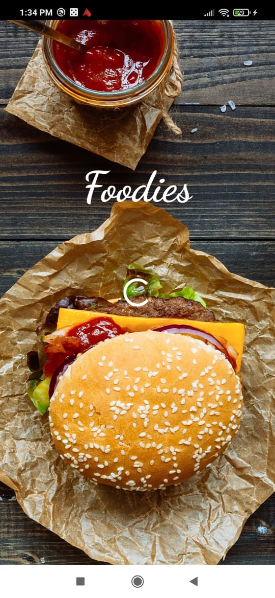
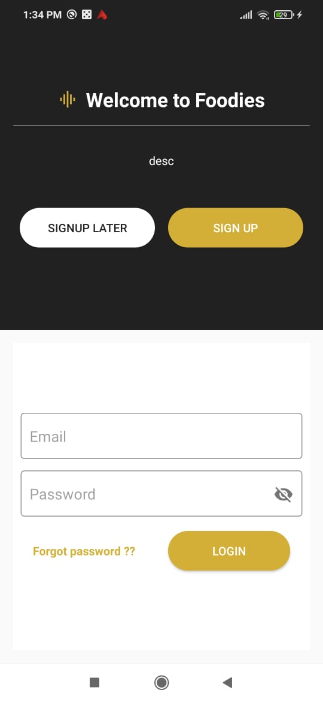
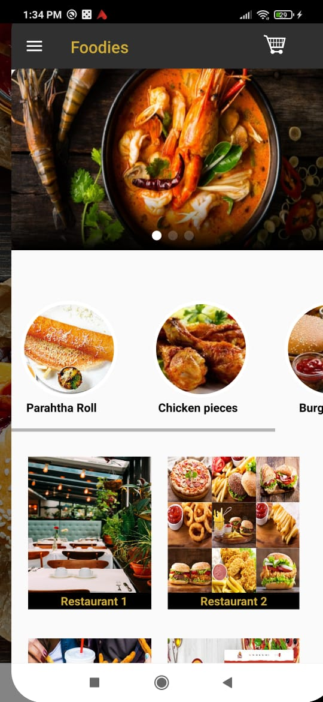
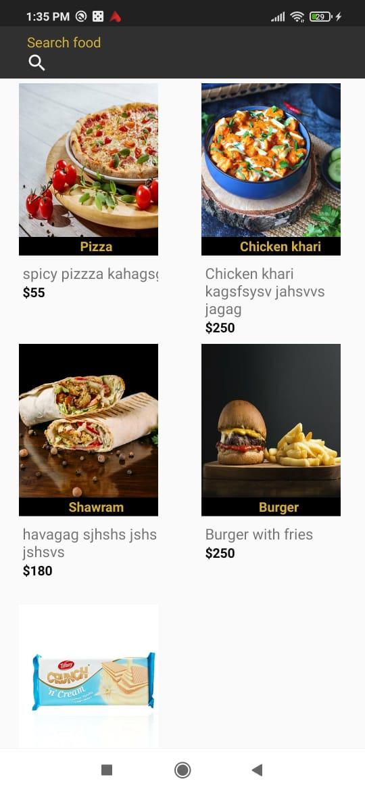
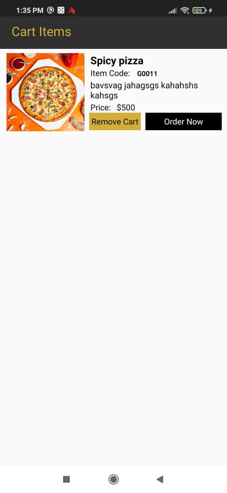
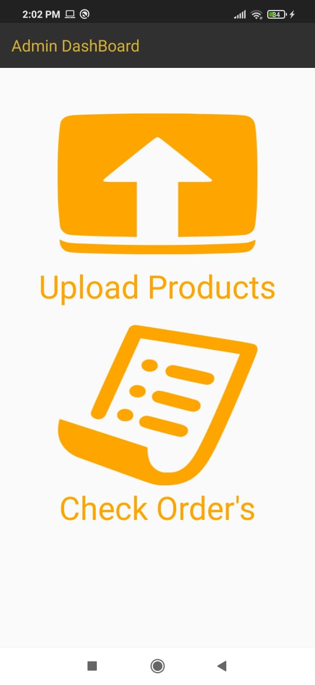

# Introduction
Foodies is afood delivery app demo built using Java and Firebase database.

## Roles
1. <b>Customer</b> can view food items and place order.
2.  <b>Admin</b> can upload food items and check orders.

## Screenshots
  
 
  

